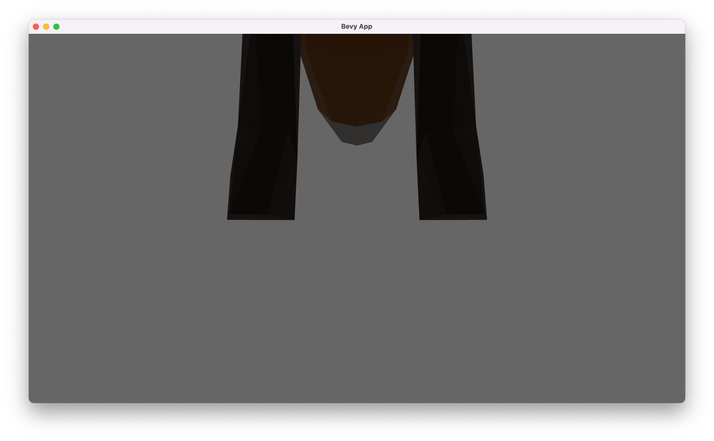

# Import a model

- Setup a window, a main game loop, and other main features with `DefaultPlugins` **`ch01/step-2-1`**

  - Bevy at its core is just a skeleton for supporting the ECS paradigm
  - a new Bevy app contains nothing; we add ECS to it to give it meanings
  - a plugin is a pack of ECS items that work together to handle a specific aspect of the game
  - window management, game loop, input management, logging, are all supported through some default plugins

- [Download](https://github.com/bevyengine/bevy/raw/main/assets/models/animated/Fox.glb) a model to `assets/models/Fox.glb`
  - you can design your 3D model _visually_ with software like Blender
  - then you can export it to formats like glTF (or its binary version `.glb`) to use it _programmatically_ in Bevy
- Load this model in Bevy app **`ch01/step-2-2`**
  - in the code we add `load_scene_system` at `Startup` phase of the game
  - scene is kind of like a container; we can put one or more models, lights and cameras together as a scene
  - here we load a scene with an `AssetServer`, and spawn it in `load_scene_system` (systems are just functions)
    ```rs
    commands.spawn(SceneBundle {
        scene: asset_server.load("models/Fox.glb#Scene0"),
        ..default()
    });
    ```
- Observe it in the window with a camera
  - let's set up a default camera for now
    ```rs
    commands.spawn(Camera3dBundle::default());
    ```
- Now run the game with `cargo run`, you'll see something like this:


