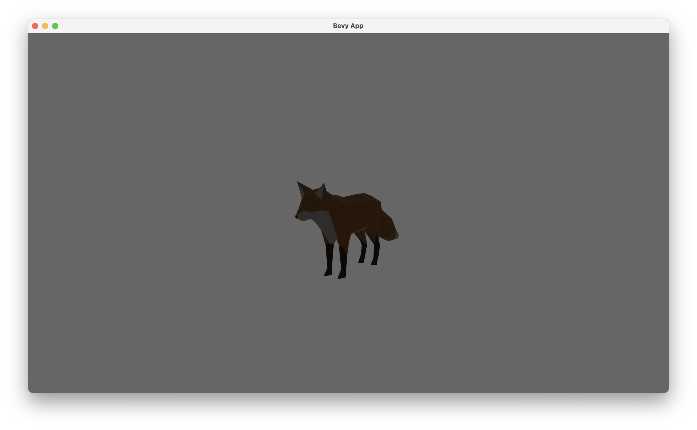
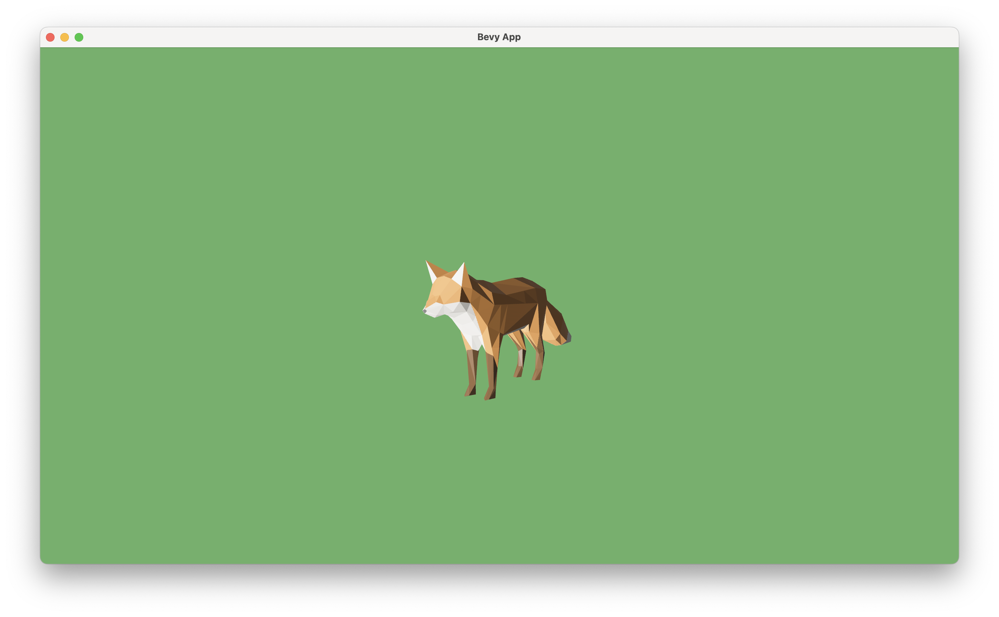

# See through a camera

- We are now already seeing the 3D game world in the window, through a _camera_

- The mechanism of a camera:

  - Without a camera, the world is just a bunch of data describing what everything is and where they are.
  - A camera uses such information to calculate what we should see from a certain point of view.
  - Specifically, given object shapes, positions, environment lightings, etc., the camera will compute colors of each pixels on the screen, as if we were seeing things directly from there; this process is called _rendering_.

- Let's move our camera to a more comfortable position.

  - In game engines, we often use the term _transform_ to represent the position, rotation (or orientation), and scale (or size) of an object.
  - If we want to move our camera to a different position and orientation, we need to define the `Transform` component on creating the `Camera3DBundle`:
    ```rs
    commands.spawn(Camera3dBundle {
        transform: Transform::from_xyz(20.0, 10.0, 30.0)
            .looking_at(Vec3::new(0.0, 5.0, 0.0), Vec3::Y),
        ..default()
    });
    ```
  - Notice how we use `from_xyz` to construct a `Transform` from that position, and then call `looking_at` on it to define rotation. Also, this fox is too big, so we scale it down a little bit, also with `Transform`.

- To understand what these numbers represent, we need to understand the coordinate system of the Bevy game world.

  - This diagram from the [Unofficial Bevy Cheat Book](https://bevy-cheatbook.github.io/features/coords.html) says everything about position. We use `from_xyz` to define the position of an object (or a camera) in a right-handed Y-up coordinate system.
    
  - The method `looking_at` is a convenient way of defining a camera rotation. It takes two arguments:
    - The first argument `target`, is the position that you want your camera to point at (hence you may not want to set it to the same position with the camera itself).
    - The second argument `up`, is used to define the up direction of the camera. Most of the time we want a horizontal view of the world, so we set the up direction to `Vec3::Y`, i.e. the _up_ direction of the same coordinate system.
    - You may notice that the `up` direction isn't perfectly orthogonal with the target direction. This is allowed, as Bevy will calculate the internal representation of the rotation (a quaternion or `Quat` representing an orientation) based on the plane formed by the two vectors.
  - As a practice, we describe this scene in terms of coordinates:
    - The fox is placed at the original, standing on the X-Z plane, facing +Z direction.
    - The camera is placed at the front-left of the fox, slightly higher, watching the fox (the eyesight drops on the fox body, a little higher than the original), keeping a horizontal view by using +Y as up direction.
  - The scene looks like this:
    

- Then, we add some lights to make this scene look more natural [TODO]

  - https://github.com/bevyengine/bevy/blob/main/examples/3d/load_gltf.rs

- Also change background color to give us a more lively feel [TODO]

- The final scene looks like this:
  
